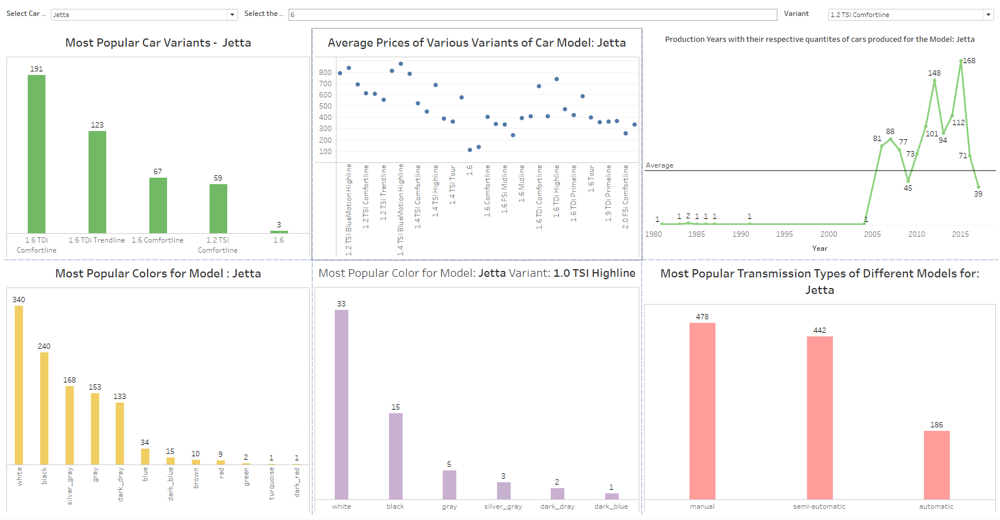
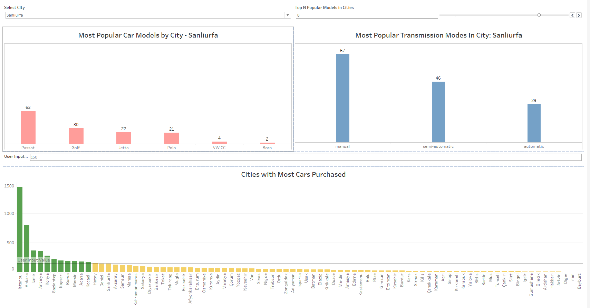
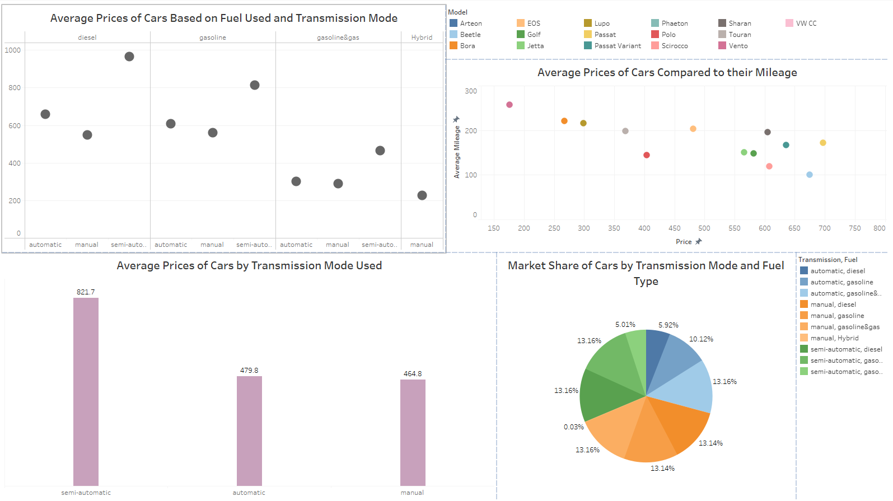
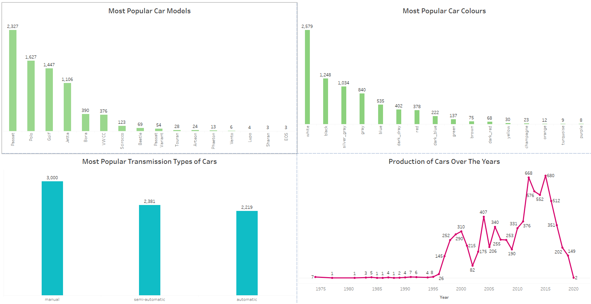

# Volkswagen Car Sales Data Visualization

## Introduction
In this project, I have visualized various intuitive car sales statistics for Volkswagen, achieved during the first quarter of 2023 in Turkey. I have leveraged Tableau for visualizing the data, with its various features 
allowing to create sophisticated as well as user-interactive plots. I combined the different plots into 4 separate dashboards based on how the attributes relate to each other in order to achieve better user understanding.

## Dataset Description
The dataset provides useful information about Volkswagen automotive sales and advertising tendencies in Turkey during the first quarter of 2023. The data can be utilized to identify patterns and trends in customer behavior, such as the most popular models, transmission styles, and fuel kinds. The data might also be used to discover which cities have the highest demand for Volkswagen vehicles and to evaluate the effectiveness of advertising campaigns.

The Online Automotive Sales Statistics'23 (Volkswagen) dataset includes 7216 records (rows) and 13 attributes (columns).
Attributes with what they mean, their Data types and Domain values:
1.	**Customer ID -** Ordinal, Domain - Integer [0 - 7216] : A unique identifying number assigned to the person who is advertising. 
2.	**Advertisement number -** Categorical, Domain - Integer : Unique identification for the AD
3.	**Brand -** Categorical, Domain - String : Brand name of the car.
4.	**Model -** Categorical, Domain - String : Model name of the car. 
5.	**Variant -** Categorical, Domain - String : Version of the car. 
6.	**Year -** Interval, Domain - Date type : Year when the car was developed and ready for use. 
7.	**Kilometer -** Categorical, Domain - Integer : Gives information about the mileage of the car in kilometers.
8.	**Color -** Categorical, Domain - String : Specifies the car color.
9.	**Transmission -** Categorical, Domain - String [Automatic, Manual] : The transmission type of the car.
10.	 **Fuel -** Categorical, Domain - String [Diesel, Gas, Gasoline] : Specifies the type of fuel the car uses to run on. 
11.	 **City -** Categorical, Domain - String : Specifies the city where the car was sold. 
12.	 **AD Date -** Interval, Domain - Date Type : Date information of the ad release. 
13.	 **Price -** Ordinal, Domain - Integer : Price of the car.

## Data Preprocessing
I performed the following data pre-processing steps on the different attributes to make the dataset ready to be used in the visualizations:
1. 	Removing null values from the dataset for the attribute - brand.
2. 	Aggregating and summarizing the data for the attributes - model, year, color, fuel and transmission, kilometer and city.
3. 	Removing null values for attributes - kilometer and city.
4. 	Removing suffixes in the attribute price and converting its data type to floating point value.

## Questions Answered
I analyzed the original attributes, looking at the various attributes and identified many questions that can be asked of the data that can provide insights for end-users 
such as sales leads and marketing managers to make key business decisions. Below is the list of questions:
1. 	Which are the most popular car models?
2. 	Which cities have the most customers that purchase cars? What are the most popular car models there? Which cities have the fewest customers?
3. 	What are the average distances traveled by cars that use different transmission modes and fuel types?
4. 	How does the average price of gasoline cars compare to diesel and hybrid cars?
5. 	How does the average price of the different car models compare to their respective mileages?
6. 	Which month of advertisement dates had the highest effect on the sales of cars?
7. 	Which car colors are the most popular among customers? What are the most popular variants of the different car models?
9. 	What are the most popular colors for each car model? What are the most popular colors for each variant of a car model?
11.  What are the most popular transmission types in cars purchased? What are the counts of fuel types used by the car by different transmission types?
12.  Which advertisement numbers brought in the highest number of car sales?
13.  Which year of production of cars is the most popular among customers? What are the distributions of years of production of different car models?
15.  What are the average prices of the different variants of the same car models?
16.   What are the averages prices of cars based on types of transmission mode used by the car?
17.   Which transmission modes are the most popular in each city?

## Images of the Dashboards
Below are the images of the dashboards created for this project.

### Dashboard 1

### Dashboard 2

### Dashboard 3

### Dashboard 4

## User Interactivity
I have implemented various interactive controls that aid the user in better understanding the visualizations and are connected to various visualizations as required. Below is the list of interactive controls I have implemented -
1.	**Select Car Model –** This is a dropdown list that is used to specify the model of the car wherever required.
2.	**Select Model Variant –** This is a dropdown list that is used to specify the variant of a particular car model wherever required.
3.	**Select City –** This is a dropdown list that is used to specify the city where the car was purchased wherever required.
4.	**Top-N Car Variants –** This is a slider provided for the user to specify the number of most popular variants of a particular car model that should be displayed as required.
5.	**Top-N Popular Models in Cities –** This is a slider provided for the user to specify the number of most popular car models that should be displayed as required.
6.	**User Input Amount for Cars Purchased –** This is a ‘Type-In’ input parameter created to allow the user to specify a particular number of cars purchased in a city.

## Links
- [Dataset](https://www.kaggle.com/datasets/bimervos/online-automotive-sales-statistics-volkswagen)
- [Mural Flowchart](https://app.mural.co/t/dvassignment0284/m/dvassignment0284/1699563981327/42f506657e2cd9915e45641bf72383a216df88c2?sender=ua05eef829bc2a8f507a20491)
- Dashboards:
  - [Dashboard 1](https://public.tableau.com/app/profile/prithvi.bhatt/viz/DVFinalProject-Group8/Dashboard1?publish=yes)
  - [Dashboard 2](https://public.tableau.com/app/profile/prithvi.bhatt/viz/DVFinalProject-Group8/Dashboard2?publish=yes)
  - [Dashboard 3](https://public.tableau.com/app/profile/prithvi.bhatt/viz/DVFinalProject-Group8/Dashboard2?publish=yes)
  - [Dashboard 4](https://public.tableau.com/app/profile/prithvi.bhatt/viz/DVFinalProject-Group8/Dashboard4?publish=yes)
